## 1. High-Level Summary (TL;DR)

- **Impact:** Medium - Enhances video upload workflow with automatic metadata extraction
- **Key Changes:**
  - ✨ Added automatic video metadata extraction (duration, resolution, cover) after upload
  - 🔧 Integrated `VideoMetadataService` to handle FFmpeg-based metadata extraction
  - 🛡️ Added graceful degradation when FFmpeg is unavailable or extraction fails
  - 💾 Implemented dual-save pattern: initial save → metadata extraction → metadata save

## 2. Visual Overview (Code & Logic Map)

```mermaid
flowchart TD
    subgraph "VideoServiceImpl.java"
        Start[uploadVideo] --> Save1[videoRepository.save]
        Save1 --> Extract[extractAndSetMetadata]
        
        subgraph "extractAndSetMetadata Method"
            Extract --> CheckFFmpeg{FFmpeg Available?}
            CheckFFmpeg -->|No| Skip[Log & Return]
            CheckFFmpeg -->|Yes| GetFile[Get Video File]
            
            GetFile --> FileExists{File Exists?}
            FileExists -->|No| WarnFile[Log Warning & Return]
            FileExists -->|Yes| ExtractMeta[videoMetadataService.extractMetadata]
            
            ExtractMeta --> Success{Extraction Success?}
            Success -->|No| WarnMeta[Log Warning]
            Success -->|Yes| SetDuration{Has Duration?}
            
            SetDuration -->|Yes| UpdateDuration[Set Duration]
            SetDuration -->|No| SetResolution{Has Resolution?}
            
            UpdateDuration --> SetResolution
            SetResolution -->|Yes| UpdateResolution[Set Resolution]
            SetResolution -->|No| SetCover{Has Cover?}
            
            UpdateResolution --> SetCover
            SetCover -->|Yes| UpdateCover[Set Cover Path]
            SetCover -->|No| Complete[Return]
            
            UpdateCover --> Complete
            WarnMeta --> Complete
        end
        
        Extract --> Save2[videoRepository.save]
        Save2 --> Response[Return VideoResponse]
    end
    
    style Start fill:#e3f2fd,color:#0d47a1
    style Save1 fill:#c8e6c9,color:#1a5e20
    style Save2 fill:#c8e6c9,color:#1a5e20
    style Response fill:#fff3e0,color:#e65100
    style CheckFFmpeg fill:#f3e5f5,color:#7b1fa2
    style FileExists fill:#f3e5f5,color:#7b1fa2
    style Success fill:#f3e5f5,color:#7b1fa2
    style Skip fill:#ffebee,color:#c62828
    style WarnFile fill:#fff3e0,color:#e65100
    style WarnMeta fill:#fff3e0,color:#e65100
```



## 3. Detailed Change Analysis

### Component: Video Service Implementation

**File:** `backend/src/main/java/com/solo/video/service/impl/VideoServiceImpl.java`

**What Changed:**
Enhanced the video upload workflow to automatically extract and store video metadata (duration, resolution, and cover image) using FFmpeg. The implementation follows a fail-safe approach where metadata extraction errors do not prevent the video upload from succeeding.

#### New Dependencies Added

| Dependency             | Type          | Purpose                                      |
| :--------------------- | :------------ | :------------------------------------------- |
| `VideoMetadataService` | Service       | Handles FFmpeg-based metadata extraction     |
| `VideoMetadata`        | DTO           | Container for extracted metadata             |
| `java.io.File`         | Java Standard | File system operations for video file access |

#### Modified Method: `uploadVideo()`

**Changes:**

- Added call to `extractAndSetMetadata(savedVideo)` after initial video save
- Added second `videoRepository.save(savedVideo)` to persist extracted metadata

**Logic Flow:**

1. Save video entity to database (original behavior)
2. Extract metadata from uploaded video file (new)
3. Save video entity again with metadata (new)
4. Return response to client

#### New Method: `extractAndSetMetadata(Video video)`

**Purpose:** Extracts video metadata and updates the video entity with duration, resolution, and cover path.

**Error Handling Strategy:**

| Scenario                    | Behavior                           | Log Level |
| :-------------------------- | :--------------------------------- | :-------- |
| FFmpeg not available        | Skip extraction, return early      | DEBUG     |
| Video file not found        | Skip extraction, return early      | WARN      |
| Metadata extraction fails   | Skip metadata update, return early | WARN      |
| Exception during extraction | Catch and log, return early        | WARN      |

**Metadata Fields Extracted:**

| Field        | Type   | Source            | Description                          |
| :----------- | :----- | :---------------- | :----------------------------------- |
| `duration`   | Long   | FFmpeg probe      | Video duration in seconds            |
| `resolution` | String | FFmpeg probe      | Video resolution (e.g., "1920x1080") |
| `coverPath`  | String | FFmpeg screenshot | Path to generated cover image        |

**Code Snippet - Metadata Extraction Logic:**

```java
if (metadata.isSuccess()) {
    if (metadata.getDuration() != null) {
        video.setDuration(metadata.getDuration());
        log.debug("提取到视频时长: {}秒", metadata.getDuration());
    }
    
    if (metadata.getResolution() != null) {
        video.setResolution(metadata.getResolution());
        log.debug("提取到视频分辨率: {}", metadata.getResolution());
    }
    
    if (metadata.getCoverPath() != null) {
        video.setCoverPath(metadata.getCoverPath());
        log.debug("提取到视频封面: {}", metadata.getCoverPath());
    }
}
```

## 4. Impact & Risk Assessment

### ✅ Benefits

- **Enhanced User Experience:** Videos automatically display duration, resolution, and cover images without manual input
- **Data Completeness:** Ensures consistent metadata across all uploaded videos
- **Graceful Degradation:** System continues to work even if FFmpeg is unavailable or extraction fails

### ⚠️ Breaking Changes

- **None:** This is a non-breaking feature addition. Existing functionality remains intact.

### 🔍 Testing Suggestions

**Scenarios to Test:**

1. **Happy Path:**
   - Upload a valid video file with FFmpeg available
   - Verify duration, resolution, and cover path are correctly extracted and saved
2. **FFmpeg Unavailable:**
   - Disable FFmpeg or remove from PATH
   - Upload a video and verify it still succeeds (metadata fields remain null)
3. **Corrupted/Invalid Video:**
   - Upload a non-video file or corrupted video
   - Verify extraction fails gracefully and video is still saved
4. **File Not Found:**
   - Simulate file deletion between save and extraction
   - Verify warning is logged and video upload completes
5. **Performance:**
   - Upload large video files (>100MB)
   - Verify metadata extraction doesn't significantly delay upload response
6. **Database Verification:**
   - Check that video record is updated with metadata after second save
   - Verify no duplicate records are created

**Edge Cases:**

- Videos with no duration (e.g., corrupted streams)
- Videos with non-standard resolutions
- Videos that cannot generate cover images
- Concurrent uploads with metadata extraction

