```mermaid
flowchart TD
    subgraph "VideoServiceImpl.java"
        Start[uploadVideo] --> Save1[videoRepository.save]
        Save1 --> Extract[extractAndSetMetadata]
        
        subgraph "extractAndSetMetadata Method"
            Extract --> CheckFFmpeg{FFmpeg Available?}
            CheckFFmpeg -->|No| Skip[Log & Return]
            CheckFFmpeg -->|Yes| GetFile[Get Video File]
            
            GetFile --> FileExists{File Exists?}
            FileExists -->|No| WarnFile[Log Warning & Return]
            FileExists -->|Yes| ExtractMeta[videoMetadataService.extractMetadata]
            
            ExtractMeta --> Success{Extraction Success?}
            Success -->|No| WarnMeta[Log Warning]
            Success -->|Yes| SetDuration{Has Duration?}
            
            SetDuration -->|Yes| UpdateDuration[Set Duration]
            SetDuration -->|No| SetResolution{Has Resolution?}
            
            UpdateDuration --> SetResolution
            SetResolution -->|Yes| UpdateResolution[Set Resolution]
            SetResolution -->|No| SetCover{Has Cover?}
            
            UpdateResolution --> SetCover
            SetCover -->|Yes| UpdateCover[Set Cover Path]
            SetCover -->|No| Complete[Return]
            
            UpdateCover --> Complete
            WarnMeta --> Complete
        end
        
        Extract --> Save2[videoRepository.save]
        Save2 --> Response[Return VideoResponse]
    end
    
    style Start fill:#e3f2fd,color:#0d47a1
    style Save1 fill:#c8e6c9,color:#1a5e20
    style Save2 fill:#c8e6c9,color:#1a5e20
    style Response fill:#fff3e0,color:#e65100
    style CheckFFmpeg fill:#f3e5f5,color:#7b1fa2
    style FileExists fill:#f3e5f5,color:#7b1fa2
    style Success fill:#f3e5f5,color:#7b1fa2
    style Skip fill:#ffebee,color:#c62828
    style WarnFile fill:#fff3e0,color:#e65100
    style WarnMeta fill:#fff3e0,color:#e65100
```

## 1. High-Level Summary (TL;DR)

- **Impact:** Medium - Enhances video upload workflow with automatic metadata extraction
- **Key Changes:**
  - ✨ Added automatic video metadata extraction (duration, resolution, cover) after upload
  - 🔧 Integrated `VideoMetadataService` to handle FFmpeg-based metadata extraction
  - 🛡️ Added graceful degradation when FFmpeg is unavailable or extraction fails
  - 💾 Implemented dual-save pattern: initial save → metadata extraction → metadata save

## 2. Visual Overview (Code & Logic Map)



## 3. Detailed Change Analysis

### Component: Video Service Implementation

**File:** `backend/src/main/java/com/solo/video/service/impl/VideoServiceImpl.java`

**What Changed:**
Enhanced the video upload workflow to automatically extract and store video metadata (duration, resolution, and cover image) using FFmpeg. The implementation follows a fail-safe approach where metadata extraction errors do not prevent the video upload from succeeding.

#### New Dependencies Added

| Dependency             | Type          | Purpose                                      |
| :--------------------- | :------------ | :------------------------------------------- |
| `VideoMetadataService` | Service       | Handles FFmpeg-based metadata extraction     |
| `VideoMetadata`        | DTO           | Container for extracted metadata             |
| `java.io.File`         | Java Standard | File system operations for video file access |

#### Modified Method: `uploadVideo()`

**Changes:**

- Added call to `extractAndSetMetadata(savedVideo)` after initial video save
- Added second `videoRepository.save(savedVideo)` to persist extracted metadata

**Logic Flow:**

1. Save video entity to database (original behavior)
2. Extract metadata from uploaded video file (new)
3. Save video entity again with metadata (new)
4. Return response to client

#### New Method: `extractAndSetMetadata(Video video)`

**Purpose:** Extracts video metadata and updates the video entity with duration, resolution, and cover path.

**Error Handling Strategy:**

| Scenario                    | Behavior                           | Log Level |
| :-------------------------- | :--------------------------------- | :-------- |
| FFmpeg not available        | Skip extraction, return early      | DEBUG     |
| Video file not found        | Skip extraction, return early      | WARN      |
| Metadata extraction fails   | Skip metadata update, return early | WARN      |
| Exception during extraction | Catch and log, return early        | WARN      |

**Metadata Fields Extracted:**

| Field        | Type   | Source            | Description                          |
| :----------- | :----- | :---------------- | :----------------------------------- |
| `duration`   | Long   | FFmpeg probe      | Video duration in seconds            |
| `resolution` | String | FFmpeg probe      | Video resolution (e.g., "1920x1080") |
| `coverPath`  | String | FFmpeg screenshot | Path to generated cover image        |

**Code Snippet - Metadata Extraction Logic:**

```java
if (metadata.isSuccess()) {
    if (metadata.getDuration() != null) {
        video.setDuration(metadata.getDuration());
        log.debug("提取到视频时长: {}秒", metadata.getDuration());
    }
    
    if (metadata.getResolution() != null) {
        video.setResolution(metadata.getResolution());
        log.debug("提取到视频分辨率: {}", metadata.getResolution());
    }
    
    if (metadata.getCoverPath() != null) {
        video.setCoverPath(metadata.getCoverPath());
        log.debug("提取到视频封面: {}", metadata.getCoverPath());
    }
}
```

## 4. Impact & Risk Assessment

### ✅ Benefits

- **Enhanced User Experience:** Videos automatically display duration, resolution, and cover images without manual input
- **Data Completeness:** Ensures consistent metadata across all uploaded videos
- **Graceful Degradation:** System continues to work even if FFmpeg is unavailable or extraction fails

### ⚠️ Breaking Changes

- **None:** This is a non-breaking feature addition. Existing functionality remains intact.

### 🔍 Testing Suggestions

**Scenarios to Test:**

1. **Happy Path:**
   - Upload a valid video file with FFmpeg available
   - Verify duration, resolution, and cover path are correctly extracted and saved
2. **FFmpeg Unavailable:**
   - Disable FFmpeg or remove from PATH
   - Upload a video and verify it still succeeds (metadata fields remain null)
3. **Corrupted/Invalid Video:**
   - Upload a non-video file or corrupted video
   - Verify extraction fails gracefully and video is still saved
4. **File Not Found:**
   - Simulate file deletion between save and extraction
   - Verify warning is logged and video upload completes
5. **Performance:**
   - Upload large video files (>100MB)
   - Verify metadata extraction doesn't significantly delay upload response
6. **Database Verification:**
   - Check that video record is updated with metadata after second save
   - Verify no duplicate records are created

**Edge Cases:**

- Videos with no duration (e.g., corrupted streams)
- Videos with non-standard resolutions
- Videos that cannot generate cover images
- Concurrent uploads with metadata extraction

<br />

<br />

## 1. High-Level Summary (TL;DR)

- **Impact:** High - Significantly improves user experience with real-time scan progress tracking and more robust video metadata extraction
- **Key Changes:**
  - ✨ Added real-time scan progress tracking with current file display and statistics (new/updated/skipped videos)
  - 🔧 Enhanced video metadata extraction with multiple fallback methods for duration parsing
  - 🎨 Redesigned scan dialog UI with progress bar, animated indicators, and cancel functionality
  - 🛡️ Improved cover extraction with multiple timestamp attempts and better error handling
  - ⚙️ Changed default behavior to update existing videos during folder scans

## 2. Visual Overview (Code & Logic Map)

```mermaid
flowchart TD
    subgraph "Frontend - MainLayout.tsx"
        Start["handleScanFolder()"] -> Poll["setInterval 500ms"]
        Poll -> Fetch["fetchScanProgress()"]
        Fetch -> UpdateUI["Update Progress & Stats"]
        UpdateUI -> Check{isScanning?}
        Check -->|Yes| Poll
        Check -->|No| Clear["clearInterval"]
    end
    
    subgraph "Backend - FileScanServiceImpl.java"
        Scan["scanFolder()"] -> Init["Initialize Counters"]
        Init -> Walk["Files.walkFileTree()"]
        Walk -> VisitFile["visitFile()"]
        VisitFile -> SetCurrent["currentScanningFile.set()"]
        SetCurrent -> Process["processVideoFile()"]
        Process -> UpdateCounts["Update Atomic Counters"]
        UpdateCounts -> Walk
    end
    
    subgraph "Backend - VideoMetadataServiceImpl.java"
        Extract["extractMetadata()"] -> GetDuration["extractDuration()"]
        GetDuration -> Try1{"format.duration?"}
        Try1 -->|Yes| Parse1["Parse Double"]
        Try1 -->|No| Try2{"format.tags.DURATION?"}
        Try2 -->|Yes| Parse2["parseDurationString()"]
        Try2 -->|No| Try3{"stream.duration?"}
        Try3 -->|Yes| Parse3["Parse Double"]
        Try3 -->|No| Try4{"stream.tags.DURATION?"}
        Try4 -->|Yes| Parse2
        Try4 -->|No| Warn["Log Warning"]
        
        Extract -> Cover["extractCover()"]
        Cover -> Loop["For Each Timestamp"]
        Loop -> TryFFmpeg["FFmpeg -ss timestamp"]
        TryFFmpeg -> CheckSize{"File > 1KB?"}
        CheckSize -->|Yes| Success["Return Cover Path"]
        CheckSize -->|No| Loop
    end
    
    subgraph "API - ScanController.java"
        Progress["getScanProgress()"] -> Build["Build Response Map"]
        Build --> Add1["progress"]
        Build --> Add2["isScanning"]
        Build --> Add3["currentScanningFile"]
        Build --> Add4["newVideos"]
        Build --> Add5["updatedVideos"]
        Build --> Add6["skippedVideos"]
        Build --> Return["ResponseEntity.ok()"]
    end
    
    style Start fill:#e3f2fd,color:#0d47a1
    style Scan fill:#e3f2fd,color:#0d47a1
    style Extract fill:#e3f2fd,color:#0d47a1
    style Progress fill:#e3f2fd,color:#0d47a1
    style UpdateUI fill:#c8e6c9,color:#1a5e20
    style Process fill:#c8e6c9,color:#1a5e20
    style Success fill:#c8e6c9,color:#1a5e20
    style Return fill:#c8e6c9,color:#1a5e20
    style Poll fill:#fff3e0,color:#e65100
    style Loop fill:#fff3e0,color:#e65100
    style Try1 fill:#f3e5f5,color:#7b1fa2
    style Try2 fill:#f3e5f5,color:#7b1fa2
    style Try3 fill:#f3e5f5,color:#7b1fa2
    style Try4 fill:#f3e5f5,color:#7b1fa2
    style CheckSize fill:#f3e5f5,color:#7b1fa2
```

## 3. Detailed Change Analysis

### Component: File Scan Service (Backend)

**Files:** `FileScanService.java`, `FileScanServiceImpl.java`, `ScanController.java`, `FolderScanRequest.java`

**What Changed:**
Enhanced the folder scanning functionality to provide real-time progress tracking and detailed statistics about the scan operation.

#### API Changes

| Endpoint             | Added Fields          | Description                                |
| :------------------- | :-------------------- | :----------------------------------------- |
| `GET /scan/progress` | `currentScanningFile` | Path of the file currently being processed |
| `GET /scan/progress` | `newVideos`           | Count of newly added videos                |
| `GET /scan/progress` | `updatedVideos`       | Count of updated existing videos           |
| `GET /scan/progress` | `skippedVideos`       | Count of skipped videos                    |

#### Configuration Changes

| Parameter        | Old Value | New Value | Description                                              |
| :--------------- | :-------- | :-------- | :------------------------------------------------------- |
| `updateExisting` | `false`   | `true`    | Default behavior now updates existing videos during scan |

#### New State Tracking

Added atomic counters for thread-safe tracking:

| Field                 | Type                      | Purpose                             |
| :-------------------- | :------------------------ | :---------------------------------- |
| `currentScanningFile` | `AtomicReference<String>` | Tracks current file being processed |
| `newVideosCount`      | `AtomicInteger`           | Counts new videos added             |
| `updatedVideosCount`  | `AtomicInteger`           | Counts existing videos updated      |
| `skippedVideosCount`  | `AtomicInteger`           | Counts videos skipped               |

***

### Component: Video Metadata Service (Backend)

**File:** `VideoMetadataServiceImpl.java`

**What Changed:**
Significantly improved video metadata extraction robustness with multiple fallback strategies for duration parsing and cover image generation.

#### Duration Extraction Improvements

The service now attempts to extract duration from multiple sources in order:

| Priority | Source                   | Format          | Fallback |
| :------- | :----------------------- | :-------------- | :------- |
| 1        | `format.duration`        | Decimal seconds | ✅        |
| 2        | `format.tags.DURATION`   | `HH:MM:SS.ms`   | ✅        |
| 3        | `stream[].duration`      | Decimal seconds | ✅        |
| 4        | `stream[].tags.DURATION` | `HH:MM:SS.ms`   | ✅        |

**New Method:** `parseDurationString(String durationStr)`

Parses duration in `HH:MM:SS.ms` format to seconds:

```java
// Example: "01:23:45.678" → 5025 seconds
```

#### Cover Extraction Enhancements

**Previous Behavior:**

- Single timestamp attempt at `min(duration * 0.1, 10.0)` seconds
- No validation of generated cover file
- Timeout: 60 seconds

**New Behavior:**

- Multiple timestamp attempts (4 different points)
- Validates cover file size (> 1KB)
- Timeout: 30 seconds per attempt
- Falls back to default timestamps for zero-duration videos

| Timestamp | Calculation       | Max Value |
| :-------- | :---------------- | :-------- |
| 1st       | `duration * 0.05` | 5.0s      |
| 2nd       | `duration * 0.1`  | 10.0s     |
| 3rd       | `duration * 0.2`  | 20.0s     |
| 4th       | `duration * 0.5`  | 60.0s     |

**Code Snippet - Cover Extraction Logic:**

```java
for (double extractTime : extractTimes) {
    // Try to extract cover at this timestamp
    if (success && Files.exists(outputCoverPath) && Files.size(outputCoverPath) > 1000) {
        log.info("封面图提取成功 (时间点: {}秒): {}", extractTime, outputCoverPath);
        return coverFileName;
    }
    // Delete invalid file and try next timestamp
    if (Files.exists(outputCoverPath)) {
        Files.delete(outputCoverPath);
    }
}
```

#### Dependency Cleanup

| Change                                  | Description                              |
| :-------------------------------------- | :--------------------------------------- |
| Removed `FileStorageService` dependency | No longer needed for metadata extraction |

***

### Component: Scan Dialog UI (Frontend)

**File:** `MainLayout.tsx`

**What Changed:**
Completely redesigned the scan dialog with real-time progress tracking, animated UI elements, and improved user experience.

#### New State Management

| State                 | Type     | Purpose                                          |
| :-------------------- | :------- | :----------------------------------------------- |
| `scanProgress`        | `number` | Progress percentage (0-100)                      |
| `currentScanningFile` | `string` | Currently processing file path                   |
| `scanStats`           | `object` | Contains newVideos, updatedVideos, skippedVideos |

#### UI Enhancements

**Before:** Simple form with checkboxes and basic start/cancel buttons

**After:** Rich UI with:

- 📊 Animated progress bar with gradient and pulse effect
- 📁 Current file display with file icon
- 📈 Real-time statistics cards (new/updated/skipped)
- 🔄 Animated loading indicators
- ❌ Cancel scan button during operation
- 💡 Helpful tooltips and hints

**Polling Mechanism:**

```typescript
// Poll every 500ms for progress updates
pollInterval = setInterval(async () => {
    const isStillScanning = await fetchScanProgress()
    if (!isStillScanning) {
        if (pollInterval) clearInterval(pollInterval)
    }
}, 500)
```

#### Visual Components

| Component         | Description                               |
| :---------------- | :---------------------------------------- |
| Progress Bar      | Gradient blue with animated pulse overlay |
| Stats Cards       | Color-coded (green/blue/gray) with icons  |
| File Display      | Truncated monospace path with file icon   |
| Loading Animation | Three bouncing dots with staggered delay  |

***

### Component: Video Service API (Frontend)

**File:** `videoService.ts`

**What Changed:**
Updated type definitions to match enhanced backend API response.

#### API Response Type Update

```typescript
// Before
getScanProgress(): Promise<{ progress: number; status: string }>

// After
getScanProgress(): Promise<{
    progress: number
    isScanning: boolean
    currentScanningFile: string
    newVideos: number
    updatedVideos: number
    skippedVideos: number
}>
```

***

### Component: Configuration

**File:** `.gitignore`

**What Changed:**
Added `storage/` directory to gitignore to prevent committing generated cover images and other storage files.

## 4. Impact & Risk Assessment

### ✅ Benefits

- **Better User Experience:** Users can now see exactly what's happening during folder scans with real-time progress and statistics
- **More Robust Metadata Extraction:** Multiple fallback strategies ensure duration and cover extraction works with a wider variety of video formats
- **Improved Default Behavior:** Setting `updateExisting=true` by default ensures videos get proper metadata on first scan
- **Better Error Recovery:** Cover extraction now tries multiple timestamps instead of failing after a single attempt

### ⚠️ Breaking Changes

| Change                        | Impact                                                               | Mitigation                                   |
| :---------------------------- | :------------------------------------------------------------------- | :------------------------------------------- |
| Default `updateExisting=true` | Scans will now update existing videos by default, potentially slower | Users can uncheck the option in UI if needed |
| API Response Structure        | Frontend must handle new fields                                      | Already updated in this commit               |

### 🔍 Testing Suggestions

**Scenarios to Test:**

1. **Happy Path - Full Scan:**
   - Scan a folder with multiple videos
   - Verify progress bar updates smoothly
   - Check statistics are accurate (new/updated/skipped)
   - Confirm current file path displays correctly
2. **Real-time Progress Tracking:**
   - Start a scan and watch the progress updates
   - Verify the polling mechanism works (500ms intervals)
   - Check that progress reaches 100% on completion
3. **Cancel Scan:**
   - Start a scan on a large folder
   - Click cancel button
   - Verify scan stops and dialog closes properly
4. **Duration Extraction Edge Cases:**
   - Videos with duration in `format.duration` field
   - Videos with duration in `format.tags.DURATION` (HH:MM:SS.ms format)
   - Videos with duration in stream metadata
   - Videos with missing duration information
5. **Cover Extraction Robustness:**
   - Videos where first timestamp produces black frame
   - Videos where early timestamps are invalid
   - Verify multiple timestamps are tried
   - Check that invalid covers (< 1KB) are rejected
6. **Default Behavior:**
   - Verify `updateExisting` checkbox is checked by default
   - Confirm existing videos get metadata updated during scan
   - Test unchecking the option still works
7. **Performance:**
   - Scan folder with 100+ videos
   - Monitor memory usage of atomic counters
   - Verify polling doesn't cause performance issues
8. **Concurrent Operations:**
   - Start scan while another scan is running
   - Verify proper error handling or blocking

**Edge Cases:**

- Empty folders
- Folders with non-video files
- Videos with zero duration
- Videos with corrupted metadata
- Network interruptions during scan
- FFmpeg unavailable during metadata extraction

